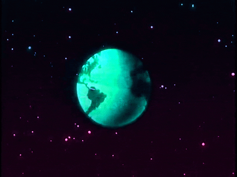

# Aliens-clicker

Le but du jeu est de collecter des aliens en cliquant sur une planète géante jusqu'à ce que vous ayez assez d'aliens pour acheter des améliorations comme des multiplicateurs de cliques ou un générateur de cliques automatique, il y a également un bonus qui tout par deux pendant 30 secondes.

## Technologies utilisées

- HTML
- CSS
- Java-script

## Contribuant

- Design [Alice](https://github.com/Frankiethezombie)

Pair Programming Javascript
- [Jinane](https://github.com/Zjinane)
- [Guillaume Dery](https://github.com/GuillaumeDery98)

## Credits 

- Credits d'image [Photofunia]( https://photofunia.com/effects/retro-wave)
- Credits font [Dafont](https://www.dafont.com/over-there.font?text=alien+clicker)
